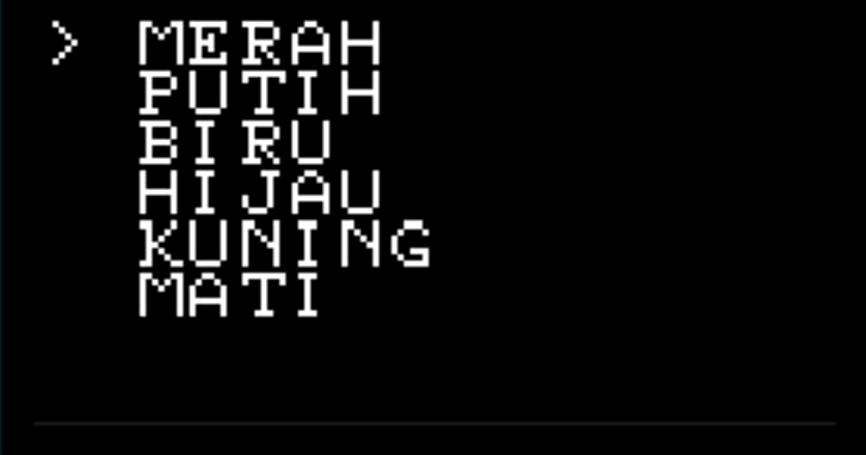

# arduino_OLED1306_U8g2_Menu-Controll-LED
arduino_OLED1306_U8g2_Controll LED
## Preparation
1. 4x Resistor 100 Ω
2. 1x LED Merah
3. 1x LED Putih
4. 1x LED Biru
5. 1x LED Hijau

## Wiring
 

## Code

1. Install Library <U8g2lib.h>
2. Install Library <Bounce2.h>

3. This Code  
https://github.com/fajarjulyana/arduino_OLED1306_U8g2_Menu-Controll-LED/blob/ed9a898b7d1e3f421047f4d0c0ef016a07dc8ecf/src/code.cpp#L1-L205
## Result 
 
